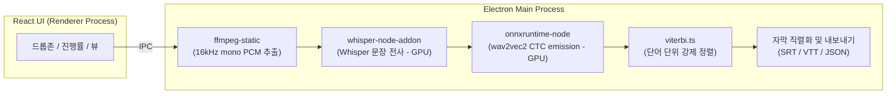

<div align="center">

# 🎬 CaptionX

**Python 없이 바로 실행되는 자막 전사 데스크톱 앱**

[](https://react.dev) [](https://www.electronjs.org) [](https://www.typescriptlang.org) [](https://vite.dev) [](LICENSE)

[English](docs/README.en-us.md) | [日本語](docs/README.ja-jp.md) | [简体中文](docs/README.zh-hans.md) | [繁體中文](docs/README.zh-hant.md)

</div>

---

## ✨ 무엇을 하나요

Whisper로 STT(Speech to Text) 전사를 수행 후 wav2vec2 강제정렬로 **단어 레벨 타임스탬프**를 만듭니다

1. **배경소음, 음악 제거(Denoising)** — GTCRN 모델을 통해 배경 소음 및 음악을 제거하여 목소리를 선명하게 향상 (선택 사항)
2. **전사** — Whisper(whisper.cpp)로 문장 단위 자막 생성
3. **단어 정렬** — wav2vec2 CTC + Viterbi 강제정렬로 **단어 하나하나의 시작/끝 시각** 산출
4. **내보내기** — SRT · VTT(인라인 단어 타임스탬프) · JSON

## 🖼️ 화면

### 전사 화면


### 보관함 화면


## 🚀 시작하기

```bash
npm install        # 의존성 설치
npm run dev        # 개발 모드 실행
npm run build      # 프로덕션 번들
npm run pack:win   # Windows 설치본 (.exe)  — pack:mac / pack:linux 도 동일
```

### 🌐 단어 정렬 지원 언어 (24종)

| 구분                         | 언어                                                                                                                                                                                              |
| ---------------------------- | ------------------------------------------------------------------------------------------------------------------------------------------------------------------------------------------------- |
| **전용 모델** (12)           | 영어 `en` · 한국어 `ko` · 일본어 `ja` · 중국어 `zh` · 스페인어 `es` · 프랑스어 `fr` · 독일어 `de` · 이탈리아어 `it` · 포르투갈어 `pt` · 러시아어 `ru` · 터키어 `tr` · 폴란드어 `pl`               |
| **다국어-56 공유 모델** (12) | 네덜란드어 `nl` · 우크라이나어 `uk` · 체코어 `cs` · 그리스어 `el` · 헝가리어 `hu` · 핀란드어 `fi` · 루마니아어 `ro` · 아랍어 `ar` · 힌디어 `hi` · 인도네시아어 `id` · 태국어 `th` · 베트남어 `vi` |

> **전용 모델**은 언어별 wav2vec2-XLSR 미세조정 모델, **다국어-56 공유 모델**은 56개 언어로 학습된 단일 XLSR 모델(`voidful/wav2vec2-xlsr-multilingual-56`)을 12개 언어가 공유해 1회만 내려받습니다. 언어를 `자동`으로 두면 전사 스크립트(한글·가나·한자·키릴·데바나가리·태국·그리스·아랍)로 정렬 언어를 추정합니다.

## 💻 지원 OS

- **Windows**: 지원 (x64) — NSIS 설치본(`.exe`)
- **Linux**: 지원 (x64) — AppImage. 내려받은 뒤 실행 권한이 필요합니다.

  ```bash
  chmod +x CaptionX-*.AppImage && ./CaptionX-*.AppImage
  ```

- **macOS**: 빌드 가능하나 검증 안 됨 (실제 기기 테스트 미완료). 배포본이 **미서명·미공증**이면
  Gatekeeper가 "손상됨"으로 차단하므로, 신뢰하는 경우에 한해 격리 속성을 제거하세요.

  ```bash
  xattr -dr com.apple.quarantine /Applications/CaptionX.app
  ```

> **GPU 가속**은 프리빌트 네이티브 모듈이 해당 플랫폼에서 지원하는 백엔드에 따라 달라집니다
> (whisper.cpp: CUDA/Metal/Vulkan, ONNX EP: DirectML/CUDA/CoreML). 지원 백엔드가 없으면
> 자동으로 CPU로 폴백하며, 이때 GPU 옵션은 조용히 무시됩니다.

## 🧱 아키텍처



| 영역      | 기술                                                                                           |
| --------- | ---------------------------------------------------------------------------------------------- |
| 셸        | Electron + electron-vite                                                                       |
| UI        | React 19 + TypeScript                                                                          |
| 전사      | [whisper.cpp](https://github.com/ggml-org/whisper.cpp) (@kutalia/whisper-node-addon, 프리빌트) |
| 단어 정렬 | wav2vec2 CTC (onnxruntime-node) + 자체 Viterbi 구현                                            |
| 디코드    | ffmpeg-static                                                                                  |
| GPU       | whisper.cpp(CUDA/Metal/Vulkan) · ONNX EP(DirectML/CUDA/CoreML)                                 |

## 🧪 코드 품질

```bash
npm run check   # lint + format:check + typecheck + deadcode + test 일괄
```

| 명령                   | 도구                         |
| ---------------------- | ---------------------------- |
| `npm run lint`         | Biome lint                   |
| `npm run format`       | Biome format                 |
| `npm run format:check` | Biome format check           |
| `npm run typecheck`    | tsc (main/renderer 분리)     |
| `npm run deadcode`     | knip                         |
| `npm run test`         | vitest                       |
| `npm run check`        | Biome + tsc + knip + vitest  |

순수 로직(Viterbi 정렬, 토크나이저, 자막 직렬화, 타임코드)은 단위 테스트로 검증됩니다.

## 📁 구조

```
src/main      전사/정렬/디코드/내보내기 파이프라인 (Electron 메인)
src/preload   contextBridge 안전 API
src/renderer  React UI
shared        main↔renderer 공유 타입
```

## 🔄 변경 사항 (Changelog)

### 정렬 · 성능 개선

- **Whisper 내장 강제정렬 제거** — 단어 타임스탬프를 얻기 위해 전체 오디오를 한 번 더
  전사하던 `whisper` 내부 word-level 정렬 모드를 제거했습니다.
  - **CJK 글자 깨짐**: whisper.cpp의 토큰 단위(`max_len=1`) 출력은 한·중·일 멀티바이트
    글자를 경계에서 쪼개 약 34%의 토큰이 깨졌습니다(`U+FFFD`).
  - **낮은 정확도**: 깨진 세그먼트는 결국 균등 분배로 대체돼, 한국어 기준 약 76%의
    세그먼트에서 결과가 버려졌습니다.
  - **느림(이중 패스)**: 전사를 두 번 수행해 정렬 단계가 불필요하게 느렸습니다.
  - 이제 단어 정렬은 **wav2vec2**로 단일화했고, 지원 모델이 없는 언어는 세그먼트
    텍스트를 균등 분배한 **근사 단어**로 폴백합니다(추가 전사 없음).
- **GTCRN 음성 향상 ~8배 가속** — 스트리밍(프레임 단위) 모델을 오프라인 모델로 교체해
  청크 단위 단일 추론으로 처리합니다.
- **단어→세그먼트 배치 선형화** — 정렬 결과 매핑을 O(세그먼트×단어)에서
  O(세그먼트+단어)로 개선했습니다.

## 🗺️ 로드맵

- [x] whisper.cpp 프리빌트 바인딩 연결 + 실제 전사 E2E 검증
- [x] Whisper · wav2vec2 모델 자동 다운로드 매니저
- [x] 영어 외 언어용 wav2vec2 정렬 모델 추가 (한국어 등 24개 언어)
- [x] 작업 취소 / 배치 처리
- [ ] 화자 분리 (Diarization)

## ✉️ 기여 및 요청사항, 버그 보고 (Contributing, Feedback & Bug Reports)

CaptionX는 오픈소스 프로젝트이며, 기여를 환영합니다! 버그 수정, 새로운 기능 제안, 번역 추가 등 어떠한 기여도 큰 도움이 됩니다.

문의사항, 기능 요청, 또는 버그 보고는 아래 방법을 이용해 주세요.

- **GitHub Issues**: 새로운 이슈를 등록해 버그를 제안하거나 기능 개선 의견을 남겨주세요.
- **Pull Requests**: 직접 수정안을 제출하실 수도 있습니다.

## 📄 License

GNU Affero General Public License v3.0 (AGPL-3.0) - [LICENSE](LICENSE) 파일을 참조하세요.
