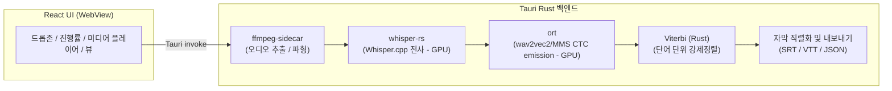

<div align="center">

# 🎬 CaptionX

**Python 없이 바로 실행되는 자막 전사 데스크톱 앱**

[](https://react.dev) [](https://tauri.app) [](https://www.rust-lang.org) [](https://www.typescriptlang.org) [](https://vite.dev) [](https://biomejs.dev) [](LICENSE)

[English](docs/README.en-us.md) | [日本語](docs/README.ja-jp.md) | [简体中文](docs/README.zh-hans.md) | [繁體中文](docs/README.zh-hant.md)

</div>

---

## ✨ 기능

Whisper로 STT(Speech to Text) 전사 후 wav2vec2 또는 MMS 강제정렬로 **단어 레벨 타임스탬프**를 생성합니다.
설치 후 바로 사용하며, Python이나 별도 런타임이 필요 없습니다.

1. **배경소음 제거(Denoising)** — GTCRN 모델로 소음·음악을 제거해 목소리를 선명하게 향상 (선택)
2. **전사** — Whisper(whisper-rs / whisper.cpp)로 문장 단위 자막 생성
3. **단어 정렬** — wav2vec2 CTC + Viterbi 강제정렬 또는 MMS(Massively Multilingual Speech)로 **단어 하나하나의 시작/끝 시각** 산출
4. **내보내기** — SRT · VTT(인라인 단어 타임스탬프) · JSON

추가 기능:
- **VAD** — 음성 구간 감지로 무음 부분 건너뛰기 (선택)
- **핫워드** — 자주 쓰는 단어·고유명사를 사전 등록해 인식률 향상
- **멀티트랙** — 다중 오디오 트랙이 포함된 영상 파일에서 트랙 선택
- **미디어 플레이어** — 전사 결과를 오디오 파형과 함께 검토
- **세그먼트 재분할** — 전사 후 글자 수 기준으로 자막 구간 재조정
- **보관함** — 전사 이력 저장 및 재사용

## 🖼️ 화면

### 전사 화면


### 보관함 화면


## 🚀 시작하기

### 릴리스 설치본 사용 (권장)

[GitHub Releases](https://github.com/samchiball/captionX/releases)에서 플랫폼별 설치본을 내려받으세요.

### 소스에서 빌드

**사전 준비**: Rust, Node.js, LLVM/Clang

```bash
npm install              # JS 의존성 설치
cargo build --manifest-path src-tauri/Cargo.toml --features full
                         # Rust 의존성 빌드 (최초 빌드 시 시간 소요)
npm run dev              # 개발 모드 (tauri dev)
npm run build            # 프로덕션 번들 + 설치본 생성 (tauri build)
```

> **`--features full`** 플래그는 LLVM/Clang이 설치된 환경에서만 활성화할 수 있습니다.
> 이 플래그 없이 빌드하면 UI는 실행되지만 실제 전사 기능은 비활성화됩니다.

### 🌐 단어 정렬 지원 언어 (30종)

| 정렬 모드          | 언어 |
| ------------------- | ---- |
| **wav2vec2 전용 모델** (12) | 영어 `en` · 한국어 `ko` · 일본어 `ja` · 중국어 `zh` · 스페인어 `es` · 프랑스어 `fr` · 독일어 `de` · 이탈리아어 `it` · 포르투갈어 `pt` · 러시아어 `ru` · 터키어 `tr` · 폴란드어 `pl` |
| **wav2vec2 다국어-56 공유** (12) | 네덜란드어 `nl` · 우크라이나어 `uk` · 체코어 `cs` · 그리스어 `el` · 헝가리어 `hu` · 핀란드어 `fi` · 루마니아어 `ro` · 아랍어 `ar` · 힌디어 `hi` · 인도네시아어 `id` · 태국어 `th` · 베트남어 `vi` |
| **MMS (메타 다국어 음성)** (+6) | 스웨덴어 `sv` · 히브리어 `he` · 노르웨이어 `no` · 덴마크어 `da` · 벵골어 `bn` · 우르두어 `ur` |

> - **wav2vec2 전용 모델**: 언어별 wav2vec2-XLSR 미세조정 모델 사용
> - **wav2vec2 다국어-56 공유 모델**: 56개 언어 학습 단일 XLSR 모델(`voidful/wav2vec2-xlsr-multilingual-56`)을 공유, 1회만 내려받음
> - **MMS 모드**: Meta의 1,000+ 언어 MMS 모델 사용 (설정에서 전환 가능)
> - 언어를 `자동`으로 두면 전사 스크립트(한글·가나·한자·키릴·데바나가리·태국·그리스·아랍)로 정렬 언어를 추정

## 💻 지원 OS

- **Windows**: 지원 (x64) — NSIS 설치본(`.exe`)
- **Linux**: 지원 (x64) — AppImage. 실행 권한이 필요합니다.

  ```bash
  chmod +x CaptionX-*.AppImage && ./CaptionX-*.AppImage
  ```

- **macOS**: 빌드 가능하나 검증 안 됨 (실제 기기 테스트 미완료). 배포본이 **미서명·미공증**이면
  Gatekeeper가 "손상됨"으로 차단하므로, 신뢰하는 경우에 한해 격리 속성을 제거하세요.

  ```bash
  xattr -dr com.apple.quarantine /Applications/CaptionX.app
  ```

## 🧱 아키텍처



| 영역      | 기술                                                                                           |
| --------- | ---------------------------------------------------------------------------------------------- |
| 셸        | Tauri 2 + Vite                                                                                 |
| UI        | React 19 + TypeScript                                                                          |
| 전사      | [whisper.cpp](https://github.com/ggml-org/whisper.cpp) (whisper-rs, Rust 네이티브 바인딩)     |
| 단어 정렬 | wav2vec2 CTC (ort / ONNX Runtime) + MMS + 자체 Viterbi 구현 (Rust)                             |
| 디코드    | ffmpeg-sidecar (번들 ffmpeg)                                                                   |
| GPU       | whisper.cpp(CUDA/Metal/Vulkan) · ONNX EP(DirectML/CUDA/CoreML)                                 |

## 🧪 코드 품질

```bash
npm run typecheck   # tsc 타입 검사 (main / renderer)
npm run lint        # Biome lint
npm run fix         # Biome lint + format 자동 수정
npm run test        # vitest
```

| 명령                   | 도구                         |
| ---------------------- | ---------------------------- |
| `npm run typecheck`    | tsc (main/renderer 분리)     |
| `npm run lint`         | Biome lint                   |
| `npm run format`       | Biome format                 |
| `npm run fix`          | Biome check --write (lint + format 일괄) |
| `npm run test`         | vitest                       |
| `npm run test:watch`   | vitest (감시 모드)           |

## 📁 구조

```
src                React UI + 훅 + 유틸 (WebView 렌더러)
src-tauri/src      Rust 백엔드 (Tauri 커맨드 / 파이프라인)
  ├── audio/       ffmpeg 오디오 추출·파형
  ├── commands/    Tauri invoke 핸들러
  ├── edit/        세그먼트 재분할
  ├── export/      SRT·VTT·JSON 직렬화
  ├── history/     전사 이력 저장소
  └── types.rs     공유 타입 정의
```

## 🔄 변경 사항 (Changelog)

### v0.2.0 — Electron → Tauri 2 마이그레이션

- **Rust 백엔드로 전환** — Node.js/Electron 메인 프로세스를 Tauri 2 + Rust 백엔드로 완전 대체
  - whisper-node-addon(프리빌트 Node.js) → whisper-rs(Rust 네이티브 바인딩)
  - onnxruntime-node → ort(Rust ONNX Runtime 바인딩)
  - contextBridge IPC → Tauri invoke 커맨드
- **MMS 정렬 모드 추가** — wav2vec2 외 Meta MMS 모델로 전환 가능, 지원 언어 24 → 30개
- **VAD 지원** — 음성 구간 감지 옵션 추가
- **핫워드 등록** — 자주 쓰는 단어·고유명사를 사전 등록해 인식률 향상
- **미디어 플레이어** — 오디오 파형 시각화와 함께 전사 결과 검토 가능
- **동시성 및 스레드 제어** — 큐 동시 처리 수와 whisper.cpp 추론 스레드 수 직접 설정

### v0.1.x — 정렬·성능 개선

- **Whisper 내장 강제정렬 제거** — 이중 전사 패스 제거, wav2vec2 단일 정렬로 통합
  - CJK 글자 깨짐 문제(~34% 토큰 `U+FFFD`) 해소
  - 한국어 기준 약 76% 세그먼트 정확도 손실 해소
- **GTCRN 음성 향상 ~8배 가속** — 스트리밍 모델 → 오프라인 오디오 단일 추론으로 교체
- **단어→세그먼트 배치 선형화** — O(세그먼트×단어) → O(세그먼트+단어)

## 🗺️ 로드맵

- [x] whisper.cpp 바인딩 연결 + 실제 전사 E2E 검증
- [x] Whisper · wav2vec2 모델 자동 다운로드 매니저
- [x] 영어 외 언어용 wav2vec2 정렬 모델 추가 (24개 언어)
- [x] 작업 취소 / 배치 처리
- [x] Tauri 2 마이그레이션 (Rust 백엔드)
- [x] MMS 정렬 모드 추가 (30개 언어)
- [ ] 화자 분리 (Diarization)

## ✉️ 기여 및 요청사항, 버그 보고 (Contributing, Feedback & Bug Reports)

CaptionX는 오픈소스 프로젝트이며, 기여를 환영합니다! 버그 수정, 새로운 기능 제안, 번역 추가 등 어떠한 기여도 큰 도움이 됩니다.

문의사항, 기능 요청, 또는 버그 보고는 아래 방법을 이용해 주세요.

- **GitHub Issues**: 새로운 이슈를 등록해 버그를 제안하거나 기능 개선 의견을 남겨주세요.
- **Pull Requests**: 직접 수정안을 제출하실 수도 있습니다.

## 📚 참고 자료 (References)

- **[whisperX](https://github.com/m-bain/whisperX)**: Whisper와 wav2vec2 강제정렬(Forced Alignment)을 결합해 정밀한 단어 레벨 타임스탬프를 획득하는 파이프라인 설계의 주요 영감이 된 프로젝트입니다.
- **[whisper.cpp](https://github.com/ggml-org/whisper.cpp)**: C/C++ 기반 고성능 Whisper 추론 엔진입니다.
- **[onnxruntime](https://github.com/microsoft/onnxruntime)**: wav2vec2 및 MMS 모델의 CPU/GPU 추론을 담당하는 고성능 엔진입니다.
- **[GTCRN](https://github.com/545907361/GTCRN)**: 배경 소음 및 음악 제거 음성 향상(Denoising)에 활용된 신경망 모델입니다.
- **[wav2vec 2.0](https://arxiv.org/abs/2006.11477)**: 단어 정렬의 특징 추출 및 CTC emission 계산에 활용되는 음성 표상 학습 프레임워크입니다.
- **[MMS](https://ai.meta.com/blog/multilingual-model-speech-recognition/)**: Meta의 1,000개 이상 언어 지원 다국어 음성 모델로, 추가 언어 정렬에 사용됩니다.

## 📄 License

GNU Affero General Public License v3.0 (AGPL-3.0) — [LICENSE](LICENSE) 파일을 참조하세요.
