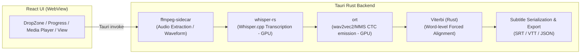

<div align="center">

# 🎬 CaptionX

**Desktop Subtitle Transcription App (Whisper Transcription + wav2vec2 Word-Level Forced Alignment)**

[](https://react.dev) [](https://tauri.app) [](https://www.rust-lang.org) [](https://www.typescriptlang.org) [](https://vite.dev) [](https://biomejs.dev) [](../LICENSE)

[한국어](../README.md) | [日本語](README.ja-jp.md) | [简体中文](README.zh-hans.md) | [繁體中文](README.zh-hant.md)

</div>

---

## ✨ Features

Whisper speech-to-text (STT) transcription followed by wav2vec2 or MMS forced alignment to generate **word-level timestamps**. No Python or separate runtime required.

1. **Noise & Music Removal (Denoising)** — Enhances voice clarity by removing background noise/music via the GTCRN model (optional).
2. **Transcription** — Generates sentence-level subtitles using Whisper (whisper-rs / whisper.cpp).
3. **Word Alignment** — Uses wav2vec2 CTC + Viterbi forced alignment or MMS (Massively Multilingual Speech) to generate **precise start/end timestamps for each word**.
4. **Export** — SRT, VTT (with inline word timestamps), JSON.

Additional Features:
- **VAD** — Voice Activity Detection to skip silent parts (optional).
- **Hotwords** — Improve recognition for common words or proper nouns.
- **Multi-track** — Select audio tracks from video files with multiple tracks.
- **Media Player** — Review transcription results with audio waveform visualization.
- **Segment Resplit** — Adjust subtitle intervals based on character count.
- **Library** — Save and reuse transcription history.

## 🖼️ Screenshots

### Transcription Screen


### History Screen


## 🚀 Getting Started

### Using Release Binary (Recommended)

Download the installer for your platform from [GitHub Releases](https://github.com/samchiball/captionX/releases).

### Build from Source

**Prerequisites**: Rust, Node.js, LLVM/Clang

```bash
npm install              # Install JS dependencies
cargo build --manifest-path src-tauri/Cargo.toml --features full
                         # Build Rust backend (takes time on first run)
npm run dev              # Dev mode (tauri dev)
npm run build            # Production bundle + installer (tauri build)
```

> **`--features full`** flag requires LLVM/Clang. Building without it will run the UI but disable transcription functionality.

### 🌐 Supported Languages for Word Alignment (30)

| Alignment Mode | Languages |
| -------------- | --------- |
| **wav2vec2 Dedicated** (12) | English `en` · Korean `ko` · Japanese `ja` · Chinese `zh` · Spanish `es` · French `fr` · German `de` · Italian `it` · Portuguese `pt` · Russian `ru` · Turkish `tr` · Polish `pl` |
| **wav2vec2 Multilingual-56** (12) | Dutch `nl` · Ukrainian `uk` · Czech `cs` · Greek `el` · Hungarian `hu` · Finnish `fi` · Romanian `ro` · Arabic `ar` · Hindi `hi` · Indonesian `id` · Thai `th` · Vietnamese `vi` |
| **MMS (Meta Multilingual)** (+6) | Swedish `sv` · Hebrew `he` · Norwegian `no` · Danish `da` · Bengali `bn` · Urdu `ur` |

> - **wav2vec2 Dedicated**: Fine-tuned wav2vec2-XLSR models per language.
> - **wav2vec2 Multilingual-56**: A single 56-language model (`voidful/wav2vec2-xlsr-multilingual-56`) shared across 12 languages.
> - **MMS Mode**: Meta's 1,000+ language MMS model (switchable in settings).
> - If set to `Auto`, the alignment language is inferred from transcribed script (Hangul, Kana, Hanzi, Cyrillic, etc.).

## 💻 Supported OS

- **Windows**: Supported (x64) — NSIS Installer (`.exe`)
- **Linux**: Supported (x64) — AppImage. Requires execution permission.

  ```bash
  chmod +x CaptionX-*.AppImage && ./CaptionX-*.AppImage
  ```

- **macOS**: Build compatible but unverified. If Gatekeeper blocks it, remove the quarantine attribute.

  ```bash
  xattr -dr com.apple.quarantine /Applications/CaptionX.app
  ```

## 🧱 Architecture



| Area           | Technology                                                                                     |
| -------------- | ---------------------------------------------------------------------------------------------- |
| Shell          | Tauri 2 + Vite                                                                                 |
| UI             | React 19 + TypeScript                                                                          |
| Transcription  | [whisper.cpp](https://github.com/ggml-org/whisper.cpp) (whisper-rs, Rust native bindings)     |
| Word Alignment | wav2vec2 CTC (ort / ONNX Runtime) + MMS + custom Viterbi implementation (Rust)                 |
| Decoding       | ffmpeg-sidecar (bundled ffmpeg)                                                                |
| GPU            | whisper.cpp (CUDA/Metal/Vulkan) · ONNX EP (DirectML/CUDA/CoreML)                               |

## 🧪 Code Quality

```bash
npm run typecheck   # tsc type check
npm run lint        # Biome lint
npm run fix         # Biome lint + format auto-fix
npm run test        # vitest
```

## 📁 Project Structure

```
src                React UI + Hooks + Utils (WebView Renderer)
src-tauri/src      Rust Backend (Tauri commands / Pipeline)
  ├── audio/       ffmpeg audio extraction & waveform
  ├── commands/    Tauri invoke handlers
  ├── edit/        Segment resplitting
  ├── export/      SRT/VTT/JSON serialization
  ├── history/     Transcription history store
  └── types.rs     Shared type definitions
```

## 🔄 Changelog

### v0.2.0 — Electron → Tauri 2 Migration

- **Switch to Rust Backend** — Replaced Node.js/Electron main process with Tauri 2 + Rust.
  - whisper-node-addon (prebuilt Node.js) → whisper-rs (Rust native bindings)
  - onnxruntime-node → ort (Rust ONNX Runtime bindings)
  - contextBridge IPC → Tauri invoke commands
- **Added MMS Alignment Mode** — Switchable to Meta MMS model, extending supported languages from 24 to 30.
- **VAD Support** — Added Voice Activity Detection option.
- **Hotwords** — Register common words/proper nouns to improve accuracy.
- **Media Player** — Review results with audio waveform visualization.
- **Concurrency Control** — Directly configure queue concurrency and whisper.cpp inference threads.

## ✉️ Contributing, Feedback & Bug Reports

CaptionX is an open-source project, and contributions are welcome!

- **GitHub Issues**: Report bugs or suggest enhancements.
- **Pull Requests**: Submit direct fixes or improvements.

## 📚 References

- **[whisperX](https://github.com/m-bain/whisperX)**: Key inspiration for the Whisper + wav2vec2 forced alignment pipeline.
- **[whisper.cpp](https://github.com/ggml-org/whisper.cpp)**: High-performance C/C++ inference engine for Whisper.
- **[onnxruntime](https://github.com/microsoft/onnxruntime)**: Engine for running wav2vec2 and MMS models on CPU/GPU.
- **[GTCRN](https://github.com/545907361/GTCRN)**: Lightweight speech enhancement model for denoising.
- **[wav2vec 2.0](https://arxiv.org/abs/2006.11477)**: Framework for speech representation and CTC emissions.

## 📄 License

GNU Affero General Public License v3.0 (AGPL-3.0) - see the [LICENSE](../LICENSE) file for details.
