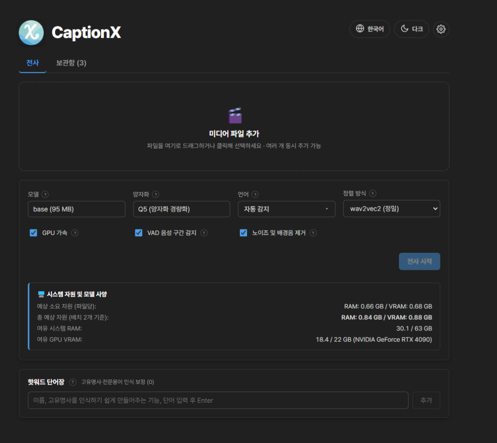
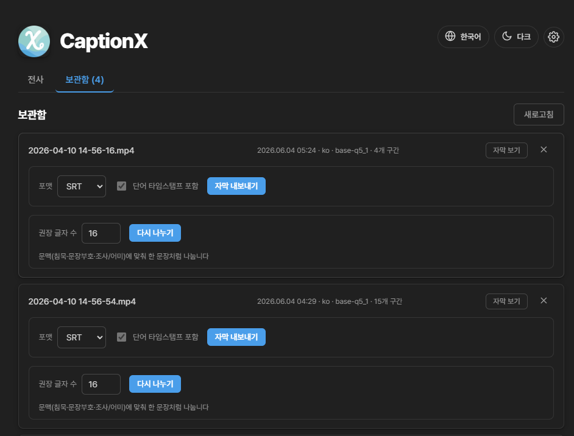
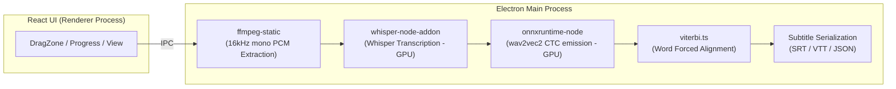

<div align="center">

# 🎬 CaptionX

**Desktop Subtitle Transcription App that runs directly without Python**

[](https://react.dev) [](https://www.electronjs.org) [](https://www.typescriptlang.org) [](https://vite.dev) [](../LICENSE)

[한국어](../README.md) | [日本語](README.ja.md) | [简体中文](README.zh.md)

</div>

---

## ✨ Features

Whisper speech-to-text (STT) transcription followed by wav2vec2 forced alignment to generate **word-level timestamps**

1. **Noise & Music Removal (Denoising)** — Removes background noise and music via the GTCRN model to enhance voice clarity (optional).
2. **Transcription** — Generates sentence-level subtitles using Whisper (whisper.cpp).
3. **Word Alignment** — Uses wav2vec2 CTC + Viterbi forced alignment to generate **precise start/end timestamps for each word**.
4. **Export** — Exports to SRT, VTT (with inline word timestamps), or JSON.

## 🖼️ Screenshots

### Transcription Screen



### History Screen



## 🚀 Getting Started

```bash
npm install        # Install dependencies
npm run dev        # Run in development mode
npm run build      # Build production bundle
npm run pack:win   # Windows Installer (.exe) — Same for pack:mac / pack:linux
```

### 🌐 Supported Languages for Word Alignment (24)

| Category                        | Languages                                                                                                                                                                         |
| ------------------------------- | --------------------------------------------------------------------------------------------------------------------------------------------------------------------------------- |
| **Dedicated Models** (12)       | English `en` · Korean `ko` · Japanese `ja` · Chinese `zh` · Spanish `es` · French `fr` · German `de` · Italian `it` · Portuguese `pt` · Russian `ru` · Turkish `tr` · Polish `pl` |
| **Multilingual-56 Shared** (12) | Dutch `nl` · Ukrainian `uk` · Czech `cs` · Greek `el` · Hungarian `hu` · Finnish `fi` · Romanian `ro` · Arabic `ar` · Hindi `hi` · Indonesian `id` · Thai `th` · Vietnamese `vi`  |

> **Dedicated Models** are language-specific wav2vec2-XLSR fine-tuned models. **Multilingual-56 Shared Models** utilize a single model trained on 56 languages (`voidful/wav2vec2-xlsr-multilingual-56`), shared among 12 languages to download only once. If the language is set to `Auto`, the alignment language is inferred from the transcribed characters (Korean, Kana, Han, Cyrillic, Devanagari, Thai, Greek, Arabic).

## 💻 Supported OS

- **Windows**: Supported (x64)
- **Linux**: Supported (x64)
- **macOS**: Build compatible but unverified (not fully tested on physical devices)

## 🧱 Architecture



| Area           | Technology                                                                                     |
| -------------- | ---------------------------------------------------------------------------------------------- |
| Window Manager | Electron + electron-vite                                                                       |
| UI             | React 19 + TypeScript                                                                          |
| Transcription  | [whisper.cpp](https://github.com/ggml-org/whisper.cpp) (@kutalia/whisper-node-addon, prebuilt) |
| Word Alignment | wav2vec2 CTC (onnxruntime-node) + custom Viterbi implementation                                |
| Decoding       | ffmpeg-static                                                                                  |
| GPU            | whisper.cpp (CUDA/Metal/Vulkan) · ONNX EP (DirectML/CUDA/CoreML)                               |

## 🧪 Code Quality

```bash
npm run check   # Runs lint + format:check + typecheck + deadcode + test
```

| Command                | Tool                         |
| ---------------------- | ---------------------------- |
| `npm run lint`         | Biome lint                   |
| `npm run format`       | Biome format                 |
| `npm run format:check` | Biome format check           |
| `npm run typecheck`    | tsc (separated node/web)     |
| `npm run deadcode`     | knip                         |
| `npm run test`         | vitest                       |
| `npm run check`        | Biome + tsc + knip + vitest |

Pure logic (Viterbi alignment, tokenizer, subtitle serialization, timecodes) is verified via unit tests.

## 📁 Project Structure

```
src/main      Main process (ASR/Align/Decode/Export pipeline)
src/preload   preload API via contextBridge
src/renderer  React UI
shared        Shared types between main and renderer
```

## 🔄 Changelog

### Alignment & Performance Improvements

- **Removed whisper.cpp Built-in Forced Alignment** — Removed the internal word-level alignment mode of `whisper` that transcribed the entire audio once more just to get word timestamps.
  - **CJK Character Corruption**: whisper.cpp's token-level (`max_len=1`) output split multi-byte Korean, Japanese, and Chinese characters at the byte boundaries, corrupting about 34% of the tokens (`U+FFFD`).
  - **Low Accuracy**: The corrupted segments eventually fell back to uniform distribution, which discarded results in about 76% of segments for Korean.
  - **Slow (Double Pass)**: Performing transcription twice made the alignment stage unnecessarily slow.
  - Now, word alignment is unified under **wav2vec2**, and languages without supported models fall back to **approximate word alignment** by uniformly distributing segment text (no additional transcription).
- **GTCRN Speech Enhancement ~8x Acceleration** — Replaced the streaming (frame-based) model with an offline model, processing with a single inference per chunk.
- **Word-to-Segment Batch Linearization** — Optimized the alignment result mapping from O(Segments × Words) to O(Segments + Words).

## 🗺️ Roadmap

- [x] whisper.cpp prebuilt bindings integration & E2E transcription verification
- [x] Whisper / wav2vec2 automated model download manager
- [x] Alignment models for non-English languages (Korean + 24 languages)
- [x] Task Cancellation / Batch Processing
- [ ] Speaker Diarization

## ✉️ Contributing, Feedback & Bug Reports

CaptionX is an open-source project, and contributions are welcome! Bug fixes, feature suggestions, and translation additions are all highly appreciated.

For questions, feature requests, or bug reports, please use the options below:

- **GitHub Issues**: Open a new issue to report bugs or suggest enhancements.
- **Pull Requests**: Submit direct fixes or improvements.

## 📄 License

GNU Affero General Public License v3.0 (AGPL-3.0) - see the [LICENSE](../LICENSE) file for details.
