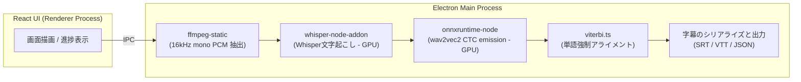

<div align="center">

# 🎬 CaptionX

**Python不要で、インストール後すぐに実行できる字幕文字起こしデスクトップアプリ**

[](https://react.dev) [](https://www.electronjs.org) [](https://www.typescriptlang.org) [](https://vite.dev) [](../LICENSE)

[한국어](../README.md) | [English](README.en.md) | [简体中文](README.zh.md)

</div>

---

## ✨ 機能

WhisperでSTT(Speech to Text)音声認識を行い、wav2vec2強制アライメントで**単語レベルのタイムスタンプ**を作成します

1. **背景ノイズ・音楽の除去(Denoising)** — GTCRNモデルを通じて背景のノイズや音楽を除去し、音声をクリアに向上（オプション）
2. **文字起こし** — Whisper (whisper.cpp)を使用して文単位の字幕を生成します。
3. **単語アライメント** — wav2vec2 CTC + Viterbi強制アライメントにより、**単語ごとの正確な開始/終了時間**を算出します。
4. **エクスポート** — SRT、VTT（インライン単語タイムスタンプ付き）、またはJSON形式で書き出します。

## 🖼️ スクリーンショット

### 文字起こし画面


### 履歴画面


## 🚀 はじめに

```bash
npm install        # 依存関係のインストール
npm run dev        # 開発モードの起動
npm run build      # プロダクションビルドの作成
npm run pack:win   # Windowsインストーラー (.exe) の作成 — pack:mac / pack:linux も同様
```

### 🌐 単語アライメント対応言語 (24種)

| 区分                          | 対応言語                                                                                                                                                                                                                        |
| ----------------------------- | ------------------------------------------------------------------------------------------------------------------------------------------------------------------------------------------------------------------------------- |
| **専用モデル** (12)           | 英語 `en` · 韓国語 `ko` · 日本語 `ja` · 中国語 `zh` · スペイン語 `es` · フランス語 `fr` · ドイツ語 `de` · イタリア語 `it` · ポルトガル語 `pt` · ロシア語 `ru` · トルコ語 `tr` · ポーランド語 `pl`                               |
| **多言語-56 共有モデル** (12) | オランダ語 `nl` · ウクライナ語 `uk` · チェコ語 `cs` · ギリシャ語 `el` · ハンガリー語 `hu` · フィンランド語 `fi` · ルーマニア語 `ro` · アラビア語 `ar` · ヒンディー語 `hi` · インドネシア語 `id` · タイ語 `th` · ベトナム語 `vi` |

> **専用モデル**は、各言語に特化してファインチューニングされたwav2vec2-XLSRモデルです。**多言語-56共有モデル**は、56言語で学習された単一のXLSRモデル(`voidful/wav2vec2-xlsr-multilingual-56`)を12言語で共有し、1回のダウンロードで共用します。言語を`自動`に設定すると、文字起こしされた文字（ハングル、かな、漢字、キリル、デーヴァナーガリー、タイ、ギリシャ、アラビア）からアライメント言語を推定します。

## 💻 対応OS

- **Windows**: 対応 (x64)
- **Linux**: 対応 (x64)
- **macOS**: ビルド可能だが未検証 (実機テスト未完了)

## 🧱 アーキテクチャ



| レイヤー         | 使用技術                                                                                         |
| ---------------- | ------------------------------------------------------------------------------------------------ |
| ウィンドウ管理   | Electron + electron-vite                                                                         |
| UI               | React 19 + TypeScript                                                                            |
| 文字起こし       | [whisper.cpp](https://github.com/ggml-org/whisper.cpp) (@kutalia/whisper-node-addon, プリビルド) |
| 単語アライメント | wav2vec2 CTC (onnxruntime-node) + 自社製Viterbi実装                                              |
| デコード         | ffmpeg-static                                                                                    |
| GPU              | whisper.cpp (CUDA/Metal/Vulkan) · ONNX EP (DirectML/CUDA/CoreML)                                 |

## 🧪 コード品質

```bash
npm run check   # lint + format:check + typecheck + deadcode + test を一括実行
```

| コマンド               | 使用ツール                      |
| ---------------------- | ------------------------------- |
| `npm run lint`         | Biome lint                      |
| `npm run format`       | Biome format                    |
| `npm run format:check` | Biome format check              |
| `npm run typecheck`    | tsc (node/web 分離)             |
| `npm run deadcode`     | knip                            |
| `npm run test`         | vitest                          |
| `npm run check`        | Biome + tsc + knip + vitest 一括 |

純粋ロジック（Viterbiアライメント、トークナイザー、字幕シリアライズ、タイムコードなど）はユニットテストで検証されます。

## 📁 構造

```
src/main      メインプロセス (文字起こし/アライメント/デコード/出力パイプライン)
src/preload   preload API (contextBridgeによる安全なAPI公開)
src/renderer  React UI
shared        メインとレンダラー間の共有型定義
```

## 🔄 変更履歴 (Changelog)

### アライメント・性能改善

- **Whisper内蔵強制アライメントの削除** — 単語タイムスタンプを取得するために、音声全体をもう一度文字起こししていた`whisper`内部のword-levelアライメントモードを削除しました。
  - **CJK文字化け**: whisper.cppのトークン単位（`max_len=1`）出力は、日中韓のマルチバイト文字を境界で分割してしまい、約34%のトークンが破損（`U+FFFD`）していました。
  - **低い精度**: 破損したセグメントは最終的に均等配分に置き換えられ、韓国語基準で約76%のセグメントで結果が破棄されていました。
  - **低速（ダブルパス）**: 文字起こしを2回実行するため、アライメント段階が不必要に遅くなっていました。
  - 今後、単語アライメントは**wav2vec2**に一本化され、対応モデルがない言語についてはセグメントテキストを均等配分した**近似単語**にフォールバックします（追加の文字起こしは行いません）。
- **GTCRN音声向上処理の約8倍高速化** — ストリーミング（フレーム単位）モデルからオフラインモデルへ置き換えることで、チャンク単位の単一推論で処理するようにしました。
- **単語→セグメントマッピングの線形化** — アライメント結果のマッピング処理を O(セグメント数 × 単語数) から O(セグメント数 + 単語数) へ改善しました。

## 🗺️ ロードマップ

- [x] whisper.cppプリビルドバインディング連携およびE2E文字起こしの検証
- [x] Whisper / wav2vec2 モデルの自動ダウンロードマネージャー
- [x] 英語以外の言語用wav2vec2アライメントモデル（日本語、韓国語など24言語）
- [x] タスクキャンセル / バッチ処理
- [ ] 話者分離 (Diarization)

## ✉️ 貢献、フィードバックとバグ報告 (Contributing, Feedback & Bug Reports)

CaptionXはオープンソースプロジェクトであり、皆様からの貢献を歓迎します！バグ修正、新機能의 提案、翻訳の追加など、あらゆる貢献が大きな力になります。

ご質問、機能要望、またはバグ報告は以下の方法をご利用ください：

- **GitHub Issues**: バグ報告や新機能の提案のために、新しいIssueを作成してください。
- **Pull Requests**: 直接的な修正や改善案を送信できます。

## 📄 ライセンス

GNU Affero General Public License v3.0 (AGPL-3.0) - 詳細については [LICENSE](../LICENSE) ファイルを参照してください。
