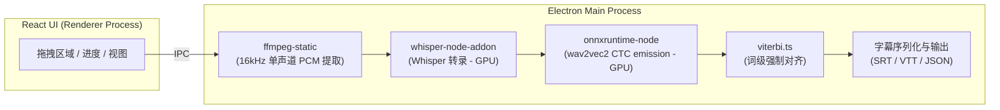

<div align="center">

# 🎬 CaptionX

**面向普通用户的字幕转录桌面应用**

[](https://react.dev) [](https://www.electronjs.org) [](https://www.typescriptlang.org) [](https://vite.dev) [](https://biomejs.dev) [](../LICENSE)

[한국어](../README.md) | [English](README.en-us.md) | [日本語](README.ja-jp.md) | [繁體中文](README.zh-hant.md)

</div>

---

## ✨ 功能

使用 Whisper 进行 STT (Speech to Text) 语音转写，随后通过 wav2vec2 强制对齐生成**词级时间戳**

1. **背景噪声与音乐去除(Denoising)** — 通过 GTCRN 模型去除背景噪声和音乐，使人声更加清晰（可选）
2. **语音转录** — 使用 Whisper (whisper.cpp) 生成句子级字幕。
3. **强制对齐** — 结合 wav2vec2 CTC + Viterbi 算法，计算**每一个单词/汉字的精确开始和结束时间**。
4. **字幕导出** — 支持导出为 SRT、VTT（包含行内词级时间戳）和 JSON 格式。

## 🖼️ 界面截图

### 转录界面


### 存档箱界面


## 🚀 快速开始

```bash
npm install        # 安装依赖
npm run dev        # 运行开发服务器
npm run build      # 打包生产环境代码
npm run pack:win   # 打包 Windows 安装包 (.exe) — pack:mac / pack:linux 类似
```

### 🌐 词级对齐支持的语言 (24种)

| 类别                        | 支持语言                                                                                                                                                                      |
| --------------------------- | ----------------------------------------------------------------------------------------------------------------------------------------------------------------------------- |
| **专用模型** (12)           | 英语 `en` · 韩语 `ko` · 日语 `ja` · 中文 `zh` · 西班牙语 `es` · 法语 `fr` · 德语 `de` · 意大利语 `it` · 葡萄牙语 `pt` · 俄语 `ru` · 土耳其语 `tr` · 波兰语 `pl`               |
| **多语言-56 共享模型** (12) | 荷兰语 `nl` · 乌克兰语 `uk` · 捷克语 `cs` · 希腊语 `el` · 匈牙利语 `hu` · 芬兰语 `fi` · 罗马尼亚语 `ro` · 阿拉伯语 `ar` · 印地语 `hi` · 印尼语 `id` · 泰语 `th` · 越南语 `vi` |

> **专用模型**是针对特定语言微调后的 wav2vec2-XLSR 模型。**多语言-56 共享模型**使用统一的 56 语言预训练模型（`voidful/wav2vec2-xlsr-multilingual-56`），供 12 种语言共享（仅需下载一次）。当语言设置为 `Auto`（自动）时，应用会根据转录出的文本字符类型（韩文、假名、汉字、西里尔字母、天城文、泰文、希腊文、阿拉伯文）自动推断并匹配相应的对齐模型。

## 💻 支持的操作系统

- **Windows**: 支持 (x64)
- **Linux**: 支持 (x64)
- **macOS**: 可编译但未验证 (未进行真机测试)

## 🧱 架构设计



| 模块     | 技术栈                                                                                       |
| -------- | -------------------------------------------------------------------------------------------- |
| 窗口管理 | Electron + electron-vite                                                                     |
| UI 界面  | React 19 + TypeScript                                                                        |
| 语音转录 | [whisper.cpp](https://github.com/ggml-org/whisper.cpp) (@kutalia/whisper-node-addon, 预编译) |
| 词级对齐 | wav2vec2 CTC (onnxruntime-node) + 自定义 Viterbi 维特比对齐算法                              |
| 音频解码 | ffmpeg-static                                                                                |
| GPU 加速 | whisper.cpp (CUDA/Metal/Vulkan) · ONNX EP (DirectML/CUDA/CoreML)                             |

## 🧪 代码质量验证

```bash
npm run check   # 一键执行 lint + format:check + typecheck + deadcode + test
```

| 命令                   | 工具                         |
| ---------------------- | ---------------------------- |
| `npm run lint`         | Biome lint                   |
| `npm run format`       | Biome format                 |
| `npm run format:check` | Biome format check           |
| `npm run typecheck`    | tsc (分别编译 node/web)      |
| `npm run deadcode`     | knip                         |
| `npm run test`         | vitest                       |
| `npm run check`        | Biome + tsc + knip + vitest |

## 📁 目录结构

```
src/main      主进程 (负责转录/对齐/解码/导出等核心 pipeline)
src/preload   preload 预加载脚本 (通过 contextBridge 暴露安全的 API)
src/renderer  渲染进程 React UI 界面
shared        主进程与渲染进程之间的共享类型定义
```

## 🔄 变更记录 (Changelog)

### 对齐与性能优化

- **移除 Whisper 内置强制对齐** — 移除了 `whisper` 内部为获取词级时间戳而对整段音频进行二次转录的 word-level 对齐模式。
  - **CJK 字符乱码**: whisper.cpp 的 Token 级（`max_len=1`）输出在处理中日韩多字节字符时，由于在字节边界进行切割，导致约 34% 的 Token 出现乱码（显示为 `U+FFFD`）。
  - **准确率低**: 出现乱码的分段最终只能以均分方式代替，以韩语为例，约有 76% 的分段结果被废弃。
  - **速度慢（双阶段处理）**: 需要进行两次转录，导致对齐阶段不必要地耗时。
  - 现在，词级对齐统一使用 **wav2vec2**。对于没有支持模型的语言，将采用对句子文本进行均分的方式生成**近似单词**（无需进行额外转录）。
- **GTCRN 语音降噪加速约 8 倍** — 将流式（帧级）模型替换为离线模型，改用单次分块推理进行处理。
- **词级到句级映射的线性化处理** — 将对齐结果映射计算从 O(句数 × 词数) 优化为 O(句数 + 词数)。

## 🗺️ 产品路线图

- [x] whisper.cpp 预编译绑定集成与端到端转录验证
- [x] Whisper 与 wav2vec2 模型自动下载管理器
- [x] 引入英语以外语言的 wav2vec2 对齐模型（支持中文、韩语等 24 种语言）
- [x] 支持取消转录任务与批量文件处理
- [ ] 说话人分离 (Speaker Diarization)

## ✉️ 参与贡献、反馈与 Bug 反馈 (Contributing, Feedback & Bug Reports)

CaptionX 是一个开源项目，欢迎大家参与贡献！无论是修复 Bug、提出新功能建议，还是添加新的翻译，我们都非常感激。

如有疑问、功能请求或 Bug 报告，请使用以下方式：

- **GitHub Issues**: 提交新的 Issue 以报告 Bug 或提出改进建议。
- **Pull Requests**: 直接提交您的修复或改进方案。

## 📚 参考资料 (References)

- **[whisperX](https://github.com/m-bain/whisperX)**: 本项目核心对齐方案的设计灵感来源，通过结合 Whisper 和 wav2vec2 强制对齐（Forced Alignment）来获得精确的词级时间戳。
- **[whisper.cpp](https://github.com/ggml-org/whisper.cpp)**: 基于 C/C++ 的高性能 Whisper 推理引擎，是本项目语音转录的基础。
- **[onnxruntime](https://github.com/microsoft/onnxruntime)**: 用于在 CPU/GPU 上高效运行 wav2vec2 模型的高性能推理引擎。
- **[GTCRN](https://github.com/545907361/GTCRN)**: 用于去除背景噪声和音乐、实现语音增强（Denoising）的超轻量神经网络模型。
- **[wav2vec 2.0](https://arxiv.org/abs/2006.11477)**: 词级强制对齐阶段用于提取特征及计算 CTC 概率的自监督语音表示学习框架。

## 📄 开源协议

本项目采用 GNU Affero General Public License v3.0 (AGPL-3.0) 协议。有关详细信息，请参阅项目根目录下的 [LICENSE](../LICENSE) 文件。
