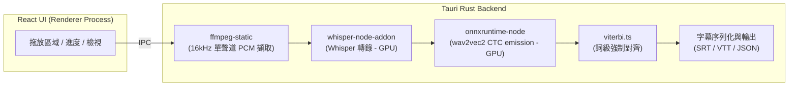

<div align="center">

# 🎬 CaptionX

**面向普通用戶的字幕轉錄桌面應用程式**

[](https://react.dev) [](https://tauri.app) [](https://www.typescriptlang.org) [](https://vite.dev) [](https://biomejs.dev) [](../LICENSE)

[한국어](../README.md) | [English](README.en-us.md) | [日本語](README.ja-jp.md) | [简体中文](README.zh-hans.md)

</div>

---

## ✨ 功能

使用 Whisper 進行 STT (Speech to Text) 語音轉寫，隨後透過 wav2vec2 強制對齊產生**詞級時間戳**

1. **背景噪音與音樂去除(Denoising)** — 透過 GTCRN 模型去除背景噪音和音樂，使人聲更加清晰（可選）
2. **語音轉錄** — 使用 Whisper (whisper.cpp) 產生句子級字幕。
3. **強制對齊** — 結合 wav2vec2 CTC + Viterbi 演算法，計算**每一個單字/漢字的精確開始和結束時間**。
4. **字幕匯出** — 支援匯出為 SRT、VTT（包含行內詞級時間戳）和 JSON 格式。

## 🖼️ 介面截圖

### 轉錄介面


### 封存箱介面


## 🚀 快速開始

```bash
npm install        # 安裝相依套件
npm run dev        # 執行開發伺服器
npm run build      # 打包生產環境程式碼
npm run pack:win   # 打包 Windows 安裝包 (.exe) — pack:mac / pack:linux 類似
```

### 🌐 詞級對齊支援的語言 (24種)

| 類別                        | 支援語言                                                                                                                                                                      |
| --------------------------- | ----------------------------------------------------------------------------------------------------------------------------------------------------------------------------- |
| **專用模型** (12)           | 英語 `en` · 韓語 `ko` · 日語 `ja` · 中文 `zh` · 西班牙語 `es` · 法語 `fr` · 德語 `de` · 義大利語 `it` · 葡萄牙語 `pt` · 俄語 `ru` · 土耳其語 `tr` · 波蘭語 `pl`               |
| **多語言-56 共享模型** (12) | 荷蘭語 `nl` · 烏克蘭語 `uk` · 捷克語 `cs` · 希臘語 `el` · 匈牙利語 `hu` · 芬蘭語 `fi` · 羅馬尼亞語 `ro` · 阿拉伯語 `ar` · 印地語 `hi` · 印尼語 `id` · 泰語 `th` · 越南語 `vi` |

> **專用模型**是針對特定語言微調後的 wav2vec2-XLSR 模型。**多語言-56 共享模型**使用統一的 56 語言預訓練模型（`voidful/wav2vec2-xlsr-multilingual-56`），供 12 種語言共享（僅需下載一次）。當語言設定為 `Auto`（自動）時，應用程式會根據轉錄出的文字字元類型（韓文、假名、漢字、西里爾字母、天城文、泰文、希臘文、阿拉伯文）自動推斷並比對相應的對齊模型。

## 💻 支援的作業系統

- **Windows**: 支援 (x64)
- **Linux**: 支援 (x64)
- **macOS**: 可編譯但未驗證 (未進行實機測試)

## 🧱 架構設計



| 模組     | 技術棧                                                                                       |
| -------- | -------------------------------------------------------------------------------------------- |
| 視窗管理 | Electron + electron-vite                                                                     |
| UI 介面  | React 19 + TypeScript                                                                        |
| 語音轉錄 | [whisper.cpp](https://github.com/ggml-org/whisper.cpp) (@kutalia/whisper-node-addon, 預編譯) |
| 詞級對齊 | wav2vec2 CTC (onnxruntime-node) + 自訂 Viterbi 維特比對齊演算法                              |
| 音訊解碼 | ffmpeg-static                                                                                |
| GPU 加速 | whisper.cpp (CUDA/Metal/Vulkan) · ONNX EP (DirectML/CUDA/CoreML)                             |

## 🧪 程式碼品質驗證

```bash
npm run check   # 一鍵執行 lint + format:check + typecheck + deadcode + test
```

| 命令                   | 工具                         |
| ---------------------- | ---------------------------- |
| `npm run lint`         | Biome lint                   |
| `npm run format`       | Biome format                 |
| `npm run format:check` | Biome format check           |
| `npm run typecheck`    | tsc (分別編譯 node/web)      |
| `npm run deadcode`     | knip                         |
| `npm run test`         | vitest                       |
| `npm run check`        | Biome + tsc + knip + vitest |

## 📁 目錄結構

```
src/main      主程序 (負責轉錄/對齊/解碼/匯出等核心 pipeline)
src/preload   preload 預先載入指令碼 (透過 contextBridge 暴露安全的 API)
src/renderer  繪製程序 React UI 介面
shared        主程序與繪製程序之間的共享型別定義
```

## 🔄 變更記錄 (Changelog)

### 對齊與效能最佳化

- **移除 Whisper 內建強制對齊** — 移除了 `whisper` 內部為取得詞級時間戳而對整段音訊進行二次轉錄的 word-level 對齊模式。
  - **CJK 字元亂碼**: whisper.cpp 的 Token 級（`max_len=1`）輸出在處理中日韓多位元組字元時，由於在位元組邊界進行切割，導致約 34% 的 Token 出現亂碼（顯示為 `U+FFFD`）。
  - **準確率低**: 出現亂碼的分段最終只能以均分方式代替，以韓語為例，約有 76% 的分段結果被廢棄。
  - **速度慢（雙階段處理）**: 需要進行兩次轉錄，導致對齊階段不必要地耗時。
  - 現在，詞級對齊統一使用 **wav2vec2**。對於沒有支援模型的語言，將採用對句子文字進行均分的方式產生**近似單字**（無需進行額外轉錄）。
- **GTCRN 語音降噪加速約 8 倍** — 將串流（影格級）模型替換為離線模型，改用單次分塊推論進行處理。
- **詞級到句級對映的線性化處理** — 將對齊結果對映計算從 O(句數 × 詞數) 最佳化為 O(句數 + 詞數)。

## 🗺️ 產品路線圖

- [x] whisper.cpp 預編譯繫結整合與端到端轉錄驗證
- [x] Whisper 與 wav2vec2 模型自動下載管理器
- [x] 引入英語以外語言的 wav2vec2 對齊模型（支援中文、韓語等 24 種語言）
- [x] 支援取消轉錄任務與批次檔案處理
- [ ] 說話人分離 (Speaker Diarization)

## ✉️ 參與貢獻、回饋與 Bug 回報 (Contributing, Feedback & Bug Reports)

CaptionX 是一個開源專案，歡迎大家參與貢獻！無論是修復 Bug、提出新功能建議，還是新增新的翻譯，我們都非常感激。

如有疑問、功能請求或 Bug 回報，請使用以下方式：

- **GitHub Issues**: 提交新的 Issue 以回報 Bug 或提出改進建議。
- **Pull Requests**: 直接提交您的修復或改進方案。

## 📚 參考資料 (References)

- **[whisperX](https://github.com/m-bain/whisperX)**: 本專案核心對齊方案的設計靈感來源，透過結合 Whisper 和 wav2vec2 強制對齊（Forced Alignment）來獲得精確的詞級時間戳。
- **[whisper.cpp](https://github.com/ggml-org/whisper.cpp)**: 基於 C/C++ 的高性能 Whisper 推理引擎，是本專案語音轉錄的基礎。
- **[onnxruntime](https://github.com/microsoft/onnxruntime)**: 用於在 CPU/GPU 上高效運行 wav2vec2 模型的高性能推理引擎。
- **[GTCRN](https://github.com/545907361/GTCRN)**: 用於去除背景噪聲和音樂、實現語音增強（Denoising）的超輕量神經網路模型。
- **[wav2vec 2.0](https://arxiv.org/abs/2006.11477)**: 詞級強制對齊階段用於提取特徵及計算 CTC 機率的自監督語音表示學習框架。

## 📄 開源授權

本專案採用 GNU Affero General Public License v3.0 (AGPL-3.0) 授權。有關詳細資訊，請參閱專案根目錄下的 [LICENSE](../LICENSE) 檔案。
